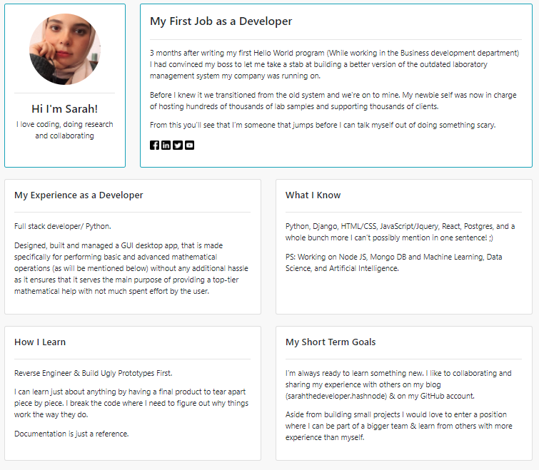

# Digital Résumé using Python & Django 

---

### Try it out by installing the requirements. (Works only with python >= 3.8, due to Django 4)
- $ pip install django
- $ pip install virtualenv
- $ pip freeze > requirements.txt

--------

### Run the Project
Open Console in Main Project Directory.
- $ git clone git@ github.com:sarahhudaib/Django-Resume.git
- $ cd Django-Resume
- $ python manage.py runserver
- on your browser (http://localhost:8000/)

---

